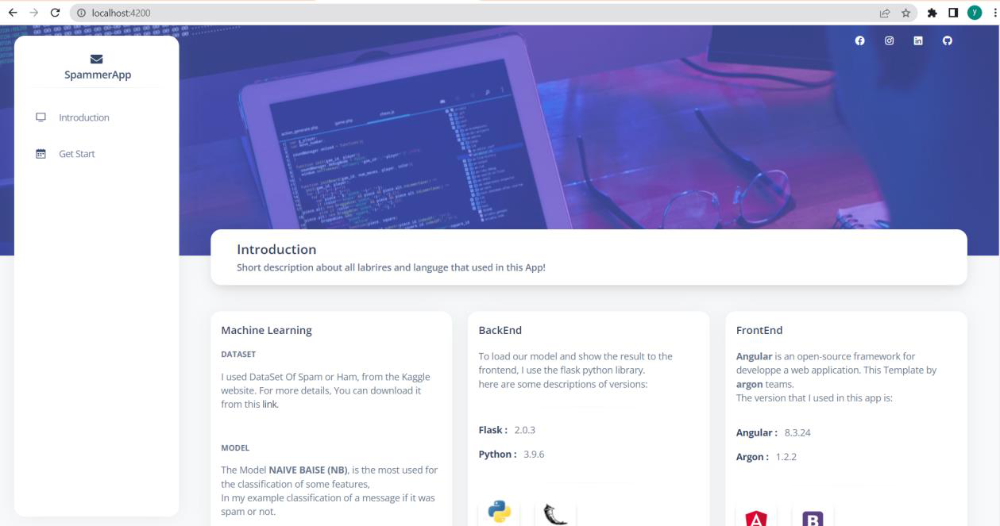
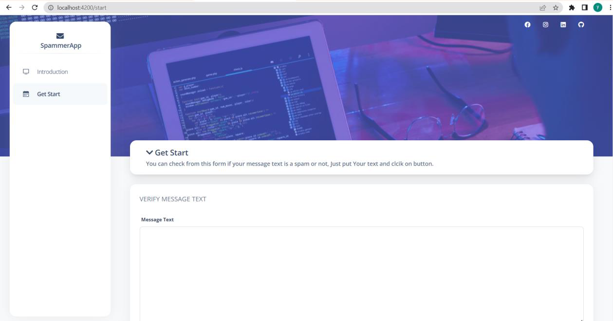
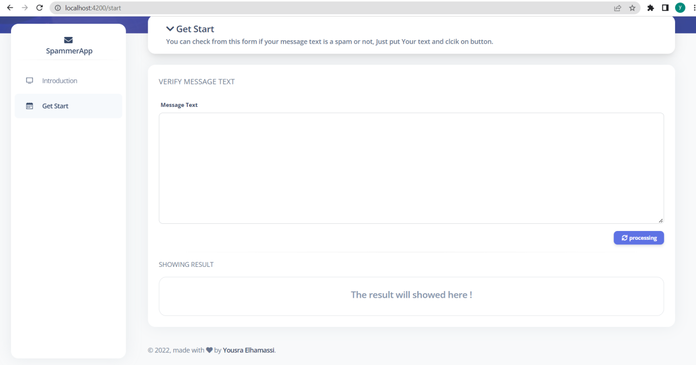
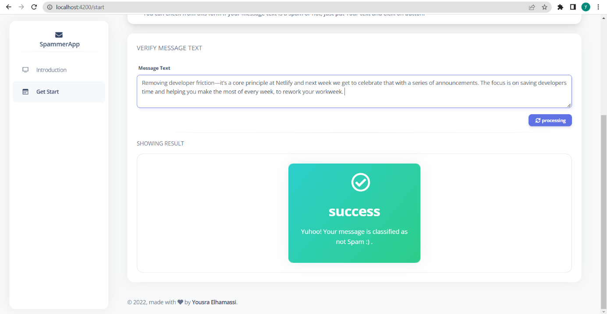
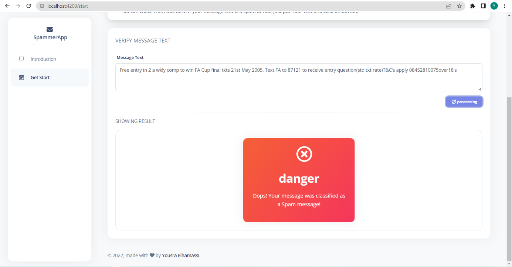

# 📧 Spammer App

> Application web de détection de spam basée sur le **Machine Learning**, avec un frontend **Angular** et un backend **Flask**.



## 📌 Présentation

**Spammer App** est une application web conçue pour aider les équipes marketing à vérifier le contenu d'un e-mail avant son envoi.

Le principe est simple : certains messages peuvent être considérés comme indésirables (*spam*) en raison de leur contenu, notamment lorsqu'ils contiennent des liens commerciaux ou des mots susceptibles de déclencher les filtres anti-spam.

L'application permet donc de **scanner un texte et de prédire s'il est considéré comme spam ou non-spam** à l'aide d'un modèle de Machine Learning entraîné sur des données de spam.

## 🎯 Objectifs

- Vérifier rapidement le contenu d'un message.
- Détecter si un texte présente des caractéristiques associées au spam.
- Retourner un résultat simple à interpréter : **spam** ou **non-spam**.
- Mettre en pratique l'utilisation du Machine Learning dans une application web.

## 🏗️ Architecture

Le projet est organisé autour de trois parties principales :

```text
┌─────────────────────┐
│      Frontend       │
│       Angular       │
└──────────┬──────────┘
           │ Requête HTTP
           ▼
┌─────────────────────┐
│       Backend       │
│        Flask        │
└──────────┬──────────┘
           │
           ▼
┌─────────────────────┐
│ Machine Learning    │
│ Modèle de détection │
└──────────┬──────────┘
           │
           ▼
      Spam / Non-spam
```

### 🤖 Machine Learning

La partie Machine Learning est développée avec **Python**. Elle traite des données de spam et utilise un modèle de classification afin de déterminer si un texte contient des caractéristiques associées au spam.

Le rapport indique l'utilisation du modèle **Naive Bayes** (mentionné dans le document comme « naïve biases »), choisi pour la classification du texte.

Le résultat de la prédiction est ensuite utilisé pour afficher un message indiquant si le contenu est considéré comme spam ou non.

### 🐍 Backend

Le backend est développé avec **Flask**.

Son rôle est notamment de :

1. Recevoir une requête contenant le texte à analyser.
2. Effectuer le traitement nécessaire.
3. Utiliser le modèle de Machine Learning pour obtenir une prédiction.
4. Retourner une réponse au frontend.

Le rapport précise également que le résultat / modèle est sauvegardé dans un fichier `.pkl`, puis transmis à une fonction permettant de retourner une réponse **YES** ou **NO** selon la classification.

### 🅰️ Frontend

L'interface utilisateur est développée avec le framework **Angular**.

L'application propose notamment :

- une page d'introduction présentant les technologies utilisées ;
- une page **Get Start** permettant de saisir un texte ;
- un bouton **Processing** pour lancer l'analyse ;
- une zone d'affichage du résultat.

## 🛠️ Technologies utilisées

| Partie | Technologie |
|---|---|
| Machine Learning | Python + modèle de classification Naive Bayes |
| Backend | Flask |
| Frontend | Angular |
| Données / modèle | Fichier `.pkl` |

## 🖥️ Interface de l'application

### Page d'introduction

La page d'introduction présente l'application ainsi que les différentes technologies utilisées.


### Page Get Start

La page **Get Start** permet à l'utilisateur de saisir le contenu d'un message afin de vérifier son statut.



### Zone de traitement

L'utilisateur saisit le texte dans la zone prévue à cet effet puis lance le traitement à l'aide du bouton **Processing**.



## 🧪 Exemples

### Exemple 1 — Texte considéré comme non-spam

Dans le premier exemple présenté dans le rapport, un texte propre est soumis à l'application. Le résultat affiché indique que le message **n'est pas considéré comme spam**.



### Exemple 2 — Texte considéré comme spam

Dans le second exemple, un texte identifié comme spam est soumis à l'application. L'interface affiche alors un résultat indiquant que le message est **classifié comme spam**.



## 🔄 Fonctionnement

Le fonctionnement global peut être résumé ainsi :

```text
Saisie du message
       │
       ▼
Envoi au backend Flask
       │
       ▼
Traitement par le modèle ML
       │
       ▼
Prédiction
   ┌───┴────┐
   │        │
   ▼        ▼
Non-spam   Spam
   │        │
   └───┬────┘
       ▼
Affichage du résultat
```

## 🚀 Utilisation

L'interface de l'application est pensée pour rester simple :

1. Ouvrir la page **Get Start**.
2. Saisir le contenu du message à vérifier.
3. Cliquer sur **Processing**.
4. Consulter le résultat retourné par l'application.

> ℹ️ Le rapport fourni décrit l'architecture et la démonstration de l'application, mais ne fournit pas les instructions complètes d'installation ou les commandes de lancement du projet. Ces informations ne sont donc pas ajoutées ici afin de rester fidèle au contenu du document source.

